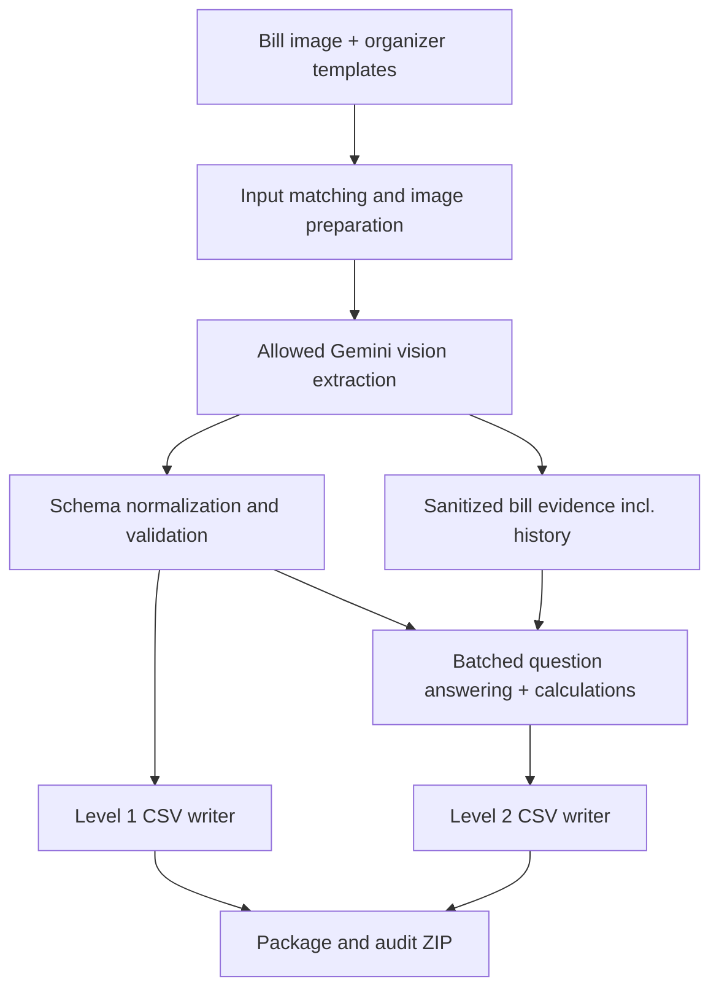

# Architecture — Utility Bill Decoder

## End-to-end flow


## Modules and interfaces
A minimal Python 3.11+ implementation: `main.py` CLI; `extract.py` vision request and bounded JSON parsing; `schema.py` typed validation/normalization; `answer.py` grouped questions, arithmetic support and answer checks; `io_utils.py` template read, image matching and CSV writing; `package.py` ZIP audit if helpful. Keep modules small; one file is acceptable if time is tight. `requirements.txt` exact pins; `.env.example` with actual nonsecret configuration, placeholder key. The solution reads `GEMINI_API_KEY` already used in user's local setup, optionally `MODEL_NAME=gemini-3.5-flash-lite`; avoid silently using any other model. Check `test_api.py` variable names before finalizing.

CLI target:
```text
python main.py --bills "test/bills" --level1-template "test/csv/level1.csv" --level2-template "test/csv/level2.csv" --output "output"
```
If training questions are absent, a training/smoke mode can run extraction only. Never hard-code question text or row order.

## Extraction
Send an appropriately oriented image to the allowed multimodal model with a strict field-by-field schema and guidance to distinguish bill charge versus tax sections. Ask for a compact JSON object and sanitized secondary evidence (e.g. 12-month usage history, tariff/unit breakdown) sufficient for Level 2. Do not request names or account numbers. Parse JSON defensively (e.g. optional code fences), but reject unknown root shape; validate types and category enums. Convert comma/currency/CR amount strings only if unambiguous; keep printed amounts rather than recomputing. Validate ISO dates and provider. If visually uncertain, targeted retry for that field/section or null. The filename can constrain provider, but never infer hidden amounts from provider norms.

## Question answering
Read template rows and group by bill_id. Pass that bill's image, sanitized evidence and all 12 original question strings in one model request to reduce latency and rate use. Require one answer keyed by question_id; use local arithmetic for extracted quantities and independently check model-supplied numbers when possible. Preserve original question text and order when writing. A question about prior-month units may require the image's usage-history table, beyond Level 1. Answer unavailable inputs candidly; no outside rates.

## Reliability and economics
Use one client per process; bounded concurrency under free-tier 15 RPM/250K TPM and 500/day (guide values), rate-limit-aware exponential backoff with jitter, short request timeout and retries. Prefer roughly 10 extraction + 10 batch-answer calls, plus targeted repairs, not 120 independent answer calls. Persist per-bill sanitized intermediate results locally so reruns skip completed work; never store identifying OCR text. Atomic output writes avoid partial CSV corruption. Log bill_id, stage, duration and error class only.

## Validation boundary
Before output: required keys, number/null/date formats, allowed categories, JSON serialization `ensure_ascii=False,separators=(',',':')`, single-line. CSV writer handles commas/quotes/newlines; normalize answer newlines to spaces. Verify 10/120 rows, exact headers and untouched template fields, distinct original IDs, no blanks. Package `output/` and `source/`, exclude `.env`, caches and data; audit archive members and actual size <=15 MB. Optional video <3 min within total cap. Do not rely on GitHub as submission: the portal accepts the ZIP.

## Caveat
The guide's exact Level 2 test questions and test images are unavailable until 12:30; they must be read from the released templates. This architecture is a target design, not a claim that implementation is complete.
